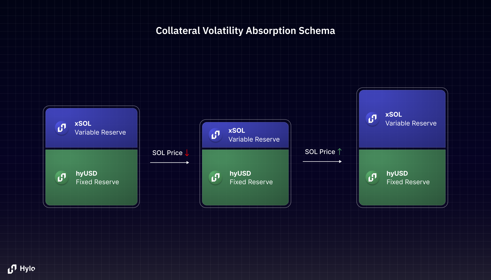
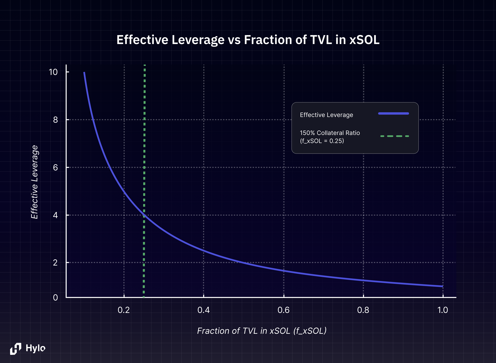

Hylo is a decentralized stablecoin protocol native to Solana. Hylo differs from traditional stablecoins in that its backing collateral consists of SOL LSTs, not cash or treasury bills. The main risk of using SOL as collateral is the price volatility inherent to the cryptocurrency market, discussed in depth [decentralized-stablecoins](../background/decentralized-stablecoins "mention").

Hylo achieves a delta-neutral position in its collateral with a radically different and autonomous strategy made possible by a simple equation and two tokens, hyUSD and xSOL.

## Two Tokens, One Pool

Hylo emits two tokens: **hyUSD** the flagship stablecoin, and **xSOL** a tokenized leveraged long position on SOL.

hyUSD and xSOL are backed by a diverse basket of LSTs called the collateral pool. At any point in time, the sum of the two tokens' market capitalizations is equivalent to the total dollar value locked in the pool. This property can be expressed with the Hylo invariant equation:

$$
\begin{equation*}
\text{Collateral TVL} = \text{hyUSD Supply} \cdot \text{hyUSD Price} + \text{xSOL Supply} \cdot \text{xSOL Price}
\end{equation*}
$$

What makes Hylo unique is the symbiotic relationship between xSOL and hyUSD. xSOL absorbs SOL price movements, allowing hyUSD to maintain a 1:1 peg with the US dollar in the face of market volatility. Simultaneously, excess value generated by the protocol's LST reserves benefits xSOL holders with outsized gains.

## Pricing hyUSD & xSOL

The price of the hyUSD token is always fixed at $1 USD - it's a stablecoin!

The price of xSOL is calculated from the amount of "variable reserve" in the collateral pool, which is the excess value not reserved to back hyUSD. The Hylo equation can be rearranged to show how the protocol automatically adjusts xSOL's price:

$$
\begin{equation*}
\text{xSOL Price} = \frac{\text{Collateral TVL} - \text{hyUSD Supply}}{\text{xSOL Supply}}
\end{equation*}
$$

As the value of the variable reserve grows, implying a price appreciation in SOL, the price of xSOL increases with effective leverage. Likewise if the SOL price dips the value of xSOL decreases, absorbing the volatility witnessed by the entire pool to maintain hyUSD's peg.

<Accordion title="Example: xSOL price adjustment">
Let's explore how the price of xSOL changes in response to SOL price fluctuations:

1. **Initial Scenario**

In our starting scenario, we have 1 SOL worth \$100 in the reserve. This reserve backs 50 hyUSD tokens, each worth \$1, for a total of \$50. The remaining \$50 of value is allocated to 50 xSOL tokens in circulation. As a result, each xSOL token is worth \$1, calculated by dividing the remaining value (\$50) by the number of xSOL tokens (50).

2. **SOL Price Increases**

Now, imagine the price of SOL doubles, making our 1 SOL worth \$200. The 50 hyUSD tokens still represent \$50, as their value remains stable. This leaves \$150 of value for xSOL. With the same 50 xSOL tokens in circulation, each token's value increases to \$3 (\$150 divided by 50 tokens). The result is that the xSOL price triples, effectively absorbing the positive price movement of SOL.

3. **SOL Price Drops**

Conversely, if the SOL price falls to \$75, our reserve is now worth only \$75. The 50 hyUSD tokens continue to represent \$50, maintaining their stable value. This scenario leaves just \$25 for xSOL. Divided among the 50 xSOL tokens, each token's value drops to \$0.50. In this case, the xSOL price halves, reflecting the negative movement of SOL's price.

These examples demonstrate how xSOL acts as a buffer, absorbing the volatility of SOL while maintaining the stability of hyUSD. The price of xSOL dynamically adjusts to balance the equation between the total reserve value and the combined value of hyUSD and xSOL.
</Accordion>

<Frame>
  
</Frame>

## Effective Leverage on xSOL

Effective leverage is a dynamic measure reflecting the xSOL token's exposure to price movements in the underlying SOL. It is computed as the ratio of the system TVL to the market capitalization of xSOL:

$$
\begin{equation*}
\text{Effective Leverage} = \frac{\text{Collateral TVL}}{\text{xSOL Market Cap}}
\end{equation*}
$$

xSOL's leverage fluctuates dynamically with activity. It rises when hyUSD is minted or xSOL is redeemed, as these increase the amount of collateral relative to xSOL supply. Conversely, it falls when hyUSD is burned or new xSOL is minted. The effective leverage is inversely related to the proportion of TVL in xSOL: a higher xSOL fraction results in lower leverage, as shown in the graphic below.

<Accordion title="Example: xSOL leverage">
Let's explore how the effective leverage of xSOL changes in different scenarios:

1. **Initial Scenario**

In our starting scenario, we have 1 SOL worth \$100 in the reserve. This reserve backs \$50 worth of hyUSD and \$50 worth of xSOL. The effective leverage of xSOL is 2x, meaning it absorbs the volatility of \$100 worth of SOL while having a market cap of only \$50. This gives xSOL holders twice the exposure to SOL price movements compared to holding SOL directly.

2. **After hyUSD Minting**

Now, imagine an additional \$50 of hyUSD is minted. Our total reserve value increases to \$150, but the xSOL market cap remains at \$50. This increases the effective leverage of xSOL to 3x. xSOL now absorbs the volatility of \$150 worth of assets while still having a market cap of \$50. This means xSOL holders now have triple the exposure to SOL price movements compared to the initial scenario.

3. **After hyUSD Redemption**

Conversely, if \$25 of hyUSD is redeemed, our total reserve value decreases to \$75. The xSOL market cap still remains at \$50. This reduces the effective leverage of xSOL to 1.5x. xSOL now absorbs the volatility of \$75 worth of assets. In this scenario, xSOL holders have less exposure to SOL price movements compared to the previous scenarios, but still 50% more exposure than holding SOL directly.

These examples demonstrate how the effective leverage of xSOL dynamically adjusts based on the amount of hyUSD in circulation. This works the other way around as well, with the leverage changing as more xSOL holders enter or exit their positions. Specifically, minting xSOL reduces leverage, while redeeming it increases this leverage.
</Accordion>

<Frame>
  
</Frame>

Hylo's stability mechanisms, detailed in [risk-management](../protocol-overview/risk-management)**,** ensure that the effective leverage on xSOL stays within a target range.
